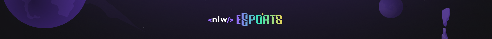

 

    O Next Level Week (NLW) é um evento totalmente online, gratuito e com foco na prática promovido pela <a href="https://www.rocketseat.com.br/">Rocketseat</a>. O evento acontece durante os dias 11 a 18 de setembro de 2022 e é direcionado para aqueles que estão começando em programação e também, para quem já está no mercado de trabalho e quer aprimorar seus conhecimentos em programação.

 

# Projeto

    O projeto consiste numa página de perfil com listas de coisas que eu gosto, como por exemplo: meus jogos favoritos e filmes prediletos. E também, uma lista com as minhas redes sociais.

 

Clique [aqui](https://murilopita.github.io/nlw-esports-explorer/) para acessar o site.

 

# Aprendizado

- HTML semântico
- Animation
- Keyframes

 

# Tecnologias

- HTML
- CSS
- Git e Github

 

# Contato

Github - [murilopita](https://github.com/murilopita)

Instagram - [m_urilo.jr](https://www.instagram.com/m_urilo.jr/)